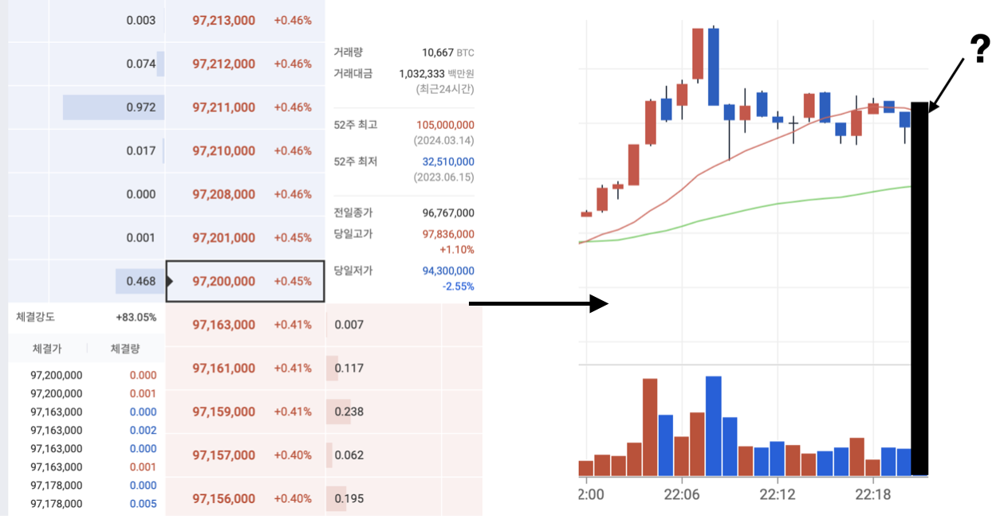

# OrderbookEncoder
This project aims to apply deep learning (Transformer-based models, in particular) methodologies for the real-time trading on cryptocurrency market.

Model is trained on the public data provided by Binance, and actual trading is executed on the Upbit (largest crypto exchange in Korea), leveraging the pre-trained model.

## Project Goal
Correctly and precisely predict the `rate of price change after 1 minute`, based on the `orderbook and trade data of previous 20 minutes`.


</img><br/>

## Preliminary
Conda environments used for this project can be replicated by the following command.
```
conda env create -f requirements.yaml
conda activate hoon
```

## Data
Raw data files can be either downloaded directly from Binance (https://www.binance.com/landing/data), or using the Binance API.

Data products used in this project is `Book Ticker`(tick-level updates of the best bid and best ask on an order book) and `Trades`(executed transactions updated at tick level).

This project used Jan/01/2024 ~ Jan/06/2024 data for training, and Jan/07/2024 data for validation.

Data files used for training in this project can be downloaded using the following command.
```
gdown {to-be-updated}
```

## Data Preprocessing Pipeline
### Orderbook Data
* Get the snapshot of `best bid & ask price and quantity` every 5 seconds (12 snapshots per minute).
* For each snapshot, we normalize the price and quantity values in the following way:
    * Price: ${Price - {Minute \ Open \ Price}} \over {|{Minute \ Close \ Price} - {Minute \ Open \ Price}|}$
        * Clipped to lie in the range of -2 to 2. (Clipping criterion can be changed)
    * Quantity: ${Best \ Ask \ Quantity} \over {{Best \ Ask \ Quantity} + {Best \ Bid \ Quantity}}$
* Each snapshot is represented as 2-dimensional (Price & Quantity in the above way) data, and it sums up to $12*2=24$-dimensional data per each minute.

### Trade Data
* Prices recorded in the trade data are first normalized in the following way (similar to the orderbook data):
    * ${Price - {Minute \ Open \ Price}} \over {|{Minute \ Close \ Price} - {Minute \ Open \ Price}|}$
        * Clipped to lie in the range of -2 to 2. (Clipping criterion can be changed)
* For each 5 seconds, get the `Maker Ratio` per each (normalized) price interval.
    * Maker Ratio: ${Total \ Trade \ Quantity \ whose \ maker \ is \ buyer} \over {Total \ Trade \ Quantity}$
    * Number of price intervals is pre-determined. In this project, we set it to be 21, but one can change this value at their convenience.
    * In case of 21 price intervals, Maker Ratio is computed for trades whose price are in between -2.0 ~ -1.8, -1.8 ~ -1.6, $\cdots$, 1.6 ~ 1.8, 1.8 ~ 2.0, respectively.
* We use `Maker Ratio of each price interval`, computed every 5 seconds, as the feature extracted from Trade data. Since we get 21-dimensional data each 5 seconds, it adds up to $12*21=252$-dimensional data per each minute.
* In addition to Maker Ratio, we further compute the `minute-interval log difference of total Trade Quantity` (not considering price intervals this time) each minute. Clearly, this is 1-dimensional data per each minute.

### Target Data
* `Rate of Price change` per each minute
    * Since these values tend to be small typically, we multiplied each values by 10 to scale them up.
        * Model will be trained to predict these multiplied values, hence one should divide model outputs by 10 to obtain the well-scaled predictions.


## Train result
Model configurations are shown in the table below.
|Hidden dimension (Transformer)|# heads|# Enc/Dec layers (Each)|
|---|---|---|
|64|2|2|

Train hyperparameters is summarized in the following table.
|# epoch|Batch Size|Learning Rate|Gamma (for StepLR)|
|---|---|---|---|
|30|16|1e-4|1|

After training, metrics evaluated on validation data were as follows:
</img><br/>

## Metrics
0. MSE Loss
* Mean Squared Error between the predicted price change rate and the actual price change rate.

* Since target value has been multiplied by 10 prior to training, one should multiply $1 \over 10$ to the printed MSE Loss to observe the actual MSE Loss.


1. Correct Rate
* Correct if predicted direction and the actual direction coincides, otherwise incorrect.


2. Recall
* ${Num \ of \ correct \ predictions \ for \ cases \ in \ denominator} \over {Num \ of \ price \ increase \ greater \ than \ threshold}$


3. Precision (Strong)
* ${Num \ of \ price \ increase \ among \ cases \ in \ denominator} \over {Num \ of \ model \ prediction \ greater \ than \ threshold}$


## Real-time Evaluation Result
Model performance was further checked based on real-time orderbook and trade data of Top 10 cryptocurrencies (sorted by market cap) from Upbit. Each experiment was 3 hour in duration, and we underwent total 2 experiments until now.


### Experiment 1
|Market Code|MSE Loss|Correct Rate|Recall|Precision (Strong)|
|---|---|---|---|---|
|KRW-BTC|0.2424|31 out of 33|7 out of 7|0 out of 0|
|KRW-ETH|0.3393|25 out of 34|6 out of 7|0 out of 0|
|KRW-SOL|0.5292|28 out of 33|11 out of 12|0 out of 0|
|KRW-XRP|0.3998|29 out of 33|7 out of 7|0 out of 0|
|KRW-ADA|Code Error|-|-|-|
|KRW-AVAX|0.6953|31 out of 34|13 out of 13|0 out of 0|
|KRW-DOGE|0.5734|27 out of 33|9 out of 9|0 out of 0|
|KRW-TRX|Code Error|-|-|-|
|KRW-LINK|Code Error|-|-|-|
|KRW-DOT|0.4794|23 out of 36|23 out of 36|0 out of 0|

</img><br/>


### Experiment 2
|Market Code|MSE Loss|Correct Rate|Recall|Precision (Strong)|
|---|---|---|---|---|
|KRW-BTC|0.3372|28 out of 32|5 out of 5|0 out of 0|
|KRW-ETH|0.4149|22 out of 33|7 out of 8|0 out of 0|
|KRW-SOL|0.7181|29 out of 32|15 out of 15|0 out of 0|
|KRW-XRP|0.4462|30 out of 32|9 out of 10|0 out of 0|
|KRW-ADA|0.7193|15 out of 34|9 out of 15|0 out of 0|
|KRW-AVAX|0.7319|32 out of 33|8 out of 9|0 out of 0|
|KRW-DOGE|0.6005|30 out of 33|9 out of 9|0 out of 0|
|KRW-TRX|Code Error|-|-|-|
|KRW-LINK|0.5485|27 out of 34|6 out of 6|0 out of 0|
|KRW-DOT|0.5779|25 out of 34|12 out of 14|0 out of 0|